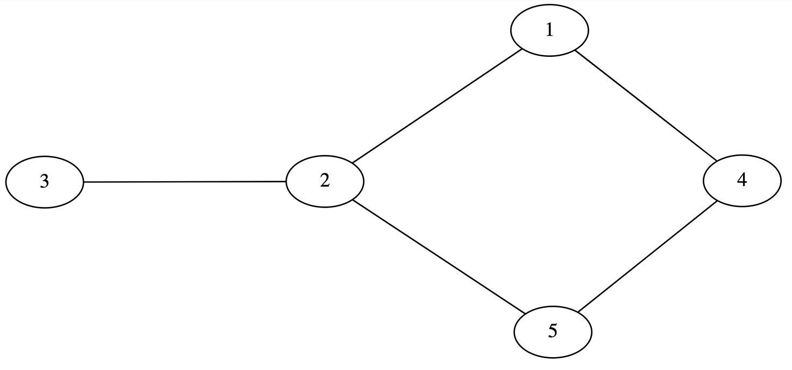
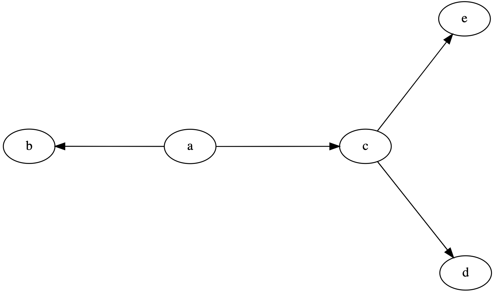

.. include:: cyverse_rst_defined_substitutions.txt
.. include:: custom_urls.txt

|CyVerse_logo|_

|Home_Icon|_
`Learning Center Home <http://learning.cyverse.org/>`_

*Intro to DOT language*
~~~~~~~~~~~~~~~~~~~~~~~~~

DOT is the graph description language. DOT describes three main kinds of objects: graphs (or network), nodes, and edges. Nodes represent units in the network, while edges represent the connections between the nodes of the network. The node of a biological network can represent genes, proteins, mRNAs, protein/protein complexes or cellular processes. DOT graphs are typically files with the filename extension gv or dot.

DOT can be used to describe both undirected (edges with no orientations) and directed (edges with orientations) graphs. Protein–protein and genetic interactions are usually represented with an undirected network, whereas transcription factor binding, phosphorylation, and metabolic networks have directionality built into their interactions. 

A DOT file for an undirected graph begins with the keyword graph followed by the name of the graph. An undirected edge between two nodes is specified using two dashes (--). Below is an example DOT file for a simple undirected graph.

.. code::

  graph graphname {
        1 -- 2;
        3 -- 2;
        4 -- 1;
        2 -- 5;
        5 -- 4;
  }

A directed graph begins with the keyword digraph followed by the name of the graph. A directed edge between two nodes is specified using a dash and arrow (->). Below is an example DOT file for a simple directed graph. 

.. code::

  digraph graphname {
          a -> b;
          a -> c; 
          c -> d;
          c -> e;
  }

Please check more examples DOT files `here <https://graphs.grevian.org/example>`_

*Prepare your data*
~~~~~~~~~~~~~~~~~~~

The example data for this tutorial is downloaded from the `ConnecTF database <https://connectf.org/>`_ that contains transcription factor (TF)-target interactions for ~ 616 TFs from three different plant species (Arabidopsis, maize and rice). The example input file is in json format, containing interactions for 5 Arabidopsis TFs (14K nodes and 23K edges). Other common interactions file formats for network visualization tools are Simple interaction file (.sif), Graph Markup Language (.gml) and Nested Network Format (.nnf).

**Input Data:**

.. list-table::
    :header-rows: 1

    * - Input
      - Description
      - Location
    * - query.cyjs
      - Example interactions input file in cytoscape json format
      - iplantcollaborative > example_data > Network_analysis_webinar

Here is a sample snippet to convert interactions file in json format to dot using NetworkX Python package:

.. code::

  import networkx as nx
  import os, json
  from networkx.drawing.nx_agraph import write_dot

  json_file = open('query.cyjs')
  data = json.load(json_file)

  G = nx.Graph()
  for n in data['elements']['nodes']:
    ntype = n['data']["type"]
    if n['data']["type"] == "": ntype = "None"
    G.add_node(n['data']["id"], type=ntype, label=n['data']["name"])

  for n in data['elements']['edges']:
    G.add_edge(n['data']["source"], n['data']["target"])

  print(nx.info(G))
  out_file_name="network.dot"
  write_dot(G, out_file_name)

*Run sfdp*
~~~~~~~~~~~~~
Scalable Force Directed Placement (sfdp) algorithm is part of Graphviz software. It's a fast multilevel force directed algorithm that efficiently layout very large graphs in a reasonably short time. Check more about sfdp and Graphviz `here <https://graphviz.org/pdf/dot.1.pdf>`_.

Here is the sfdp command to create layout for dot file generated in the previous step: 

.. code::
    
    sfdp -Goverlap=prism -Nshape=point -Goutputorder=edgesfirst -Tsvg network.dot -O

.. image:: ./img/network.dot.svg
   :scale: 10 %

*Node attribute manipulation*
~~~~~~~~~~~~~~~~~~~~~~~~~~~~~~~~~~~~~~~

NetworkX library allows to attach attributes such as weight, labels, color to networks, nodes or edges. Attributes are provided in key/value pairs. Check more about adding attributes using NetworkX `here <https://networkx.org/documentation/stable/tutorial.html#adding-attributes-to-graphs-nodes-and-edges>`_.

Here is a snippet adding node colors to network generated in previous step:

.. code::

  import networkx as nx 
  import os
  from networkx.drawing.nx_agraph import write_dot
  import pygraphviz as pgv 

  G=nx.Graph(pgv.AGraph("network.dot"))

  color={"METABOLIC":"red", "OTHER_RNA":"green","TXNFACTOR":"blue","PRE_TRNA":"yellow"}
  #Set color on node based on node type
  for n in G.nodes():
      if G.nodes[n]['type'] in color:
        G.nodes[n]['color']=color[G.nodes[n]['type']]
      else:
        G.nodes[n]['color']='black'

  out_file_name="network3.dot"
  write_dot(G, out_file_name)
  os.system("sfdp -Goverlap=prism -Nshape=point -Goutputorder=edgesfirst -Tsvg "+out_file_name+" -O")

.. image:: ./img/network3.dot.svg
   :scale: 10 %

*Edge attribute manipulation*
~~~~~~~~~~~~~~~~~~~~~~~~~~~~~~~~~~~~~~~

*Subgraph Manipulation*
~~~~~~~~~~~~~~~~~~~~~~~~~~

*Clustering*
~~~~~~~~~~~~~

----

**Fix or improve this documentation**

- Search for an answer:
  |CyVerse Learning Center|
- Ask us for help:
  click |Intercom| on the lower right-hand side of the page
- Report an issue or submit a change:
  |Github Repo Link|
- Send feedback: `learning@CyVerse.org <learning@CyVerse.org>`_

----

|Home_Icon|_
`Learning Center Home <http://learning.cyverse.org/>`_

.. Comment: Place Images Below This Line
   use :width: to give a desired width for your image
   use :height: to give a desired height for your image
   replace the image name/location and URL if hyperlinked

 .. |Clickable hyperlinked image| image:: ./img/IMAGENAME.png
    :width: 500
    :height: 100
 .. _CyVerse logo: http://learning.cyverse.org/

 .. |Static image| image:: ./img/IMAGENAME.png
    :width: 25
    :height: 25

.. Comment: Place URLS Below This Line

   # Use this example to ensure that links open in new tabs, avoiding
   # forcing users to leave the document, and making it easy to update links
   # In a single place in this document

   .. |Substitution| raw:: html # Place this anywhere in the text you want a hyperlink

      <a href="REPLACE_THIS_WITH_URL" target="blank">Replace_with_text</a>

.. |Github Repo Link|  raw:: html

   <a href="FIX_FIX_FIX_FIX_FIX_FIX_FIX_FIX_FIX_FIX_FIX_FIX_FIX_FIX_FIX" target="blank">Github Repo Link</a>
